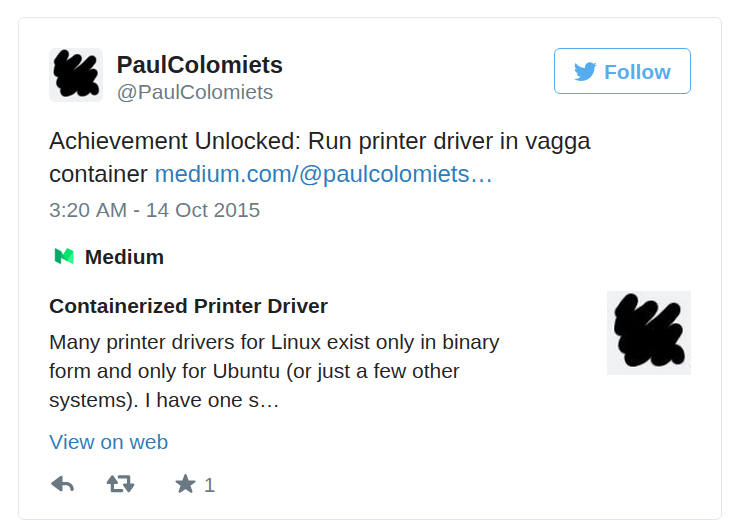

:css: my.css

.. role:: strike
   :class: strike

.. title:: Vagga

----

=====
Vagga
=====

----

The Development Tool
====================

----

The Development Tool
====================

*Do Not Try in Production!*

----

Runs Your Web Project
=====================

----

Runs Your Web Project
=====================

.. code-block:: console
   :class: fs18

   $ vagga run
   Okay, I'm ready at http://localhost:8000

----

Can Also
========

.. code-block:: console
   :class: fs14

   $ vagga
   Available commands:
       build               Transform presentation.rst -> .html
       pdf                 Render pdf version of presentation
       serve               Serve me http://localhost:8000

----

Run Your Tests
==============

.. code-block:: console
   :class: fs18

   $ vagga test
   Ok 200 succeed, 20 failed

----

Build .deb Package
==================

.. code-block:: console
   :class: fs12

   $ vagga build-package-ubuntu-precise
   Done. The new package has been saved to
   dist/12.04/program_1.2.3-1_amd64.deb

   $ vagga build-package-ubuntu-trusty
   Done. The new package has been saved to
   dist/14.04/program_1.2.3-1_amd64.deb

----

----

..

  Running in a Vagga container in user space would make it possible
  to simply copy your locally built and tested software stack to a
  cluster and run - no matter whether it runs
  Scientific Linux, SLES, CERN-CentOS or whatever in whatever version.

  -- `vagga#89`__

.. __: https://github.com/tailhook/vagga/issues/89

----

Lint
====

.. image:: flake8.png

----

