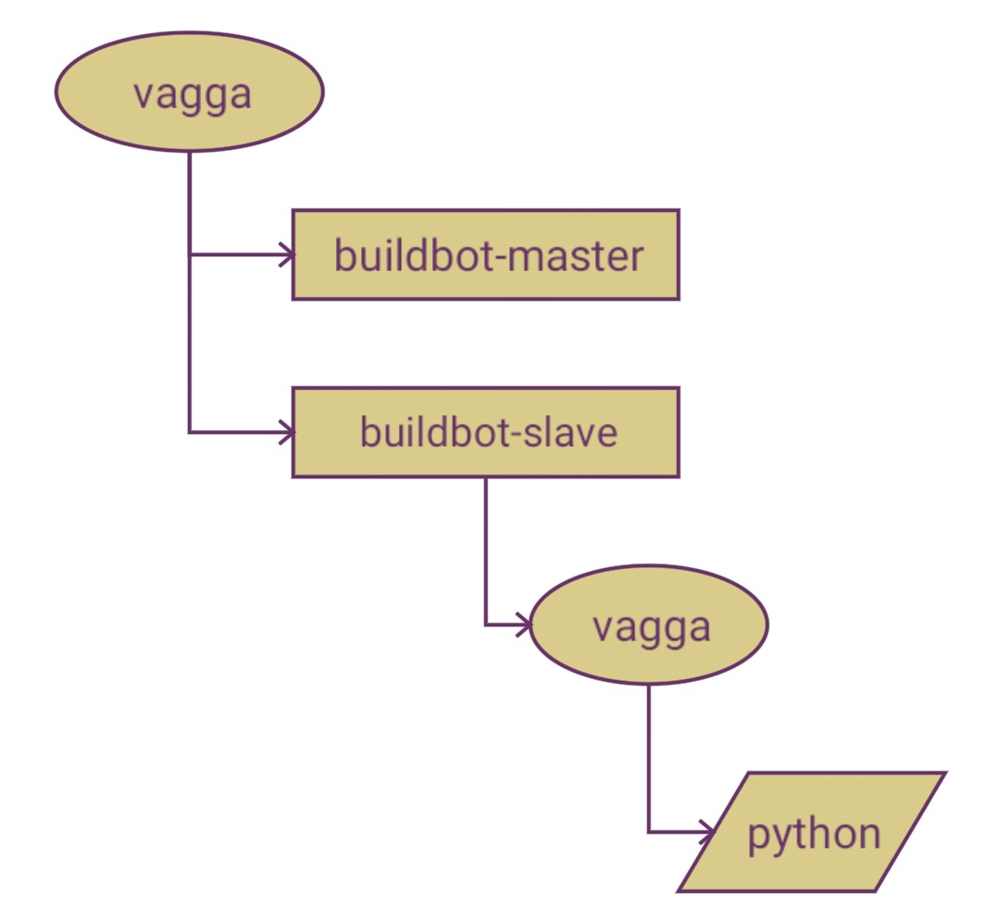

:css: my.css

.. role:: strike
   :class: strike

.. role:: sm
   :class: small

.. role:: big-brace
   :class: big-brace

.. title:: Vagga

----

=====
Vagga
=====

----

The Development Tool
====================

----

The Development Tool
====================

*Do Not Try in Production!*

----

Runs Your Web Project
=====================

----

Runs Your Web Project
=====================

.. code-block:: console
   :class: fs18

   $ vagga run
   Okay, I'm ready at http://localhost:8000

----

Can Also
========

.. code-block:: console
   :class: fs14

   $ vagga
   Available commands:
       build               Transform presentation.rst -> .html
       pdf                 Render pdf version of presentation
       serve               Serve me http://localhost:8000

----

Run Your Tests
==============

.. code-block:: console
   :class: fs18

   $ vagga test
   Ok 200 succeed, 20 failed

----

Build .deb Package
==================

.. code-block:: console
   :class: fs12

   $ vagga build-package-ubuntu-precise
   Done. The new package has been saved to
   dist/12.04/program_1.2.3-1_amd64.deb

   $ vagga build-package-ubuntu-trusty
   Done. The new package has been saved to
   dist/14.04/program_1.2.3-1_amd64.deb

----

----

.. image:: printer_tweet.png

----

..

  Running in a Vagga container in user space would make it possible
  to simply copy your locally built and tested software stack to a
  cluster and run - no matter whether it runs
  Scientific Linux, SLES, CERN-CentOS or whatever in whatever version.

  -- `vagga#89`__

.. __: https://github.com/tailhook/vagga/issues/89

----

Lint
====

.. image:: flake8.png

----

Many Environments
=================

.. code-block:: console
   :class: fs14

   $ vagga
   vagga build-QtCreator3.4.0-Qt5.2.1-Ubuntu14.04.3
   vagga build-QtCreator3.4.1-Qt5.2.1-Ubuntu14.04.3
   vagga build-QtCreator3.4.2-Qt5.2.1-Ubuntu14.04.3
   vagga build-QtCreator3.4.0-Qt5.2.1-Ubuntu14.10.1
   vagga build-QtCreator3.4.1-Qt5.2.1-Ubuntu14.10.1
   vagga build-QtCreator3.4.2-Qt5.2.1-Ubuntu14.10.1

----

NodeOS
======

----

Tutorial
========

----

Deployment
==========

----

Docker
======

----

:data-rotate-z: -90
:data-x: r0
:data-y: r800

:strike:`Docker`
================

----

:data-x: r1200
:data-y: r0

* :strike:`Docker`
* chroot

----

* :strike:`Docker`
* chroot
* systemd-nspawn

----

* :strike:`Docker`
* chroot
* systemd-nspawn
* runc

----

* :strike:`Docker`
* chroot
* systemd-nspawn
* runc
* rkt

----

* :strike:`Docker`
* chroot
* systemd-nspawn
* runc
* rkt
* lxc

----

+------------------------+----------------+---------+
|   * :strike:`Docker`   |                |         |
|   * chroot + unshare   |                |         |
|   * systemd-nspawn     | :big-brace:`}` | Linux   |
|   * runc               |                |         |
|   * rkt                |                |         |
|   * lxc                |                |         |
+------------------------+----------------+---------+

----

Roadmap
=======

----

Image Pull/Push
===============

* signed
* needed for travis-ci

----

Lint
====

editorconfig_-like:

.. code-block:: console
   :class: fs18

   $ vagga check-py
   $ vagga check-js

.. _editorconfig: http://editorconfig.org

----

Completion
==========

.. code-block:: console
   :class: fs18

   $ vagga _complete --bash make

----

Bootstrapping
=============

.. code-block:: console
   :class: fs18

   $ vagga _bootstrap py
   Use python3? [Y/n]
   Add manage.py command? [Y/n]
   Add sphinx documentation? [Y/n]

----

Global Commands
===============

.. code-block:: console
   :class: fs18

   $ vagga _install python3.5
   $ vagga _global python3.5 -q
   >>>
   $ ln -s /usr/bin/vagga ~/bin/python3.5
   $ python3.5 -q
   >>>

*inspired by* pipsi_

.. _pipsi: https://github.com/mitsuhiko/pipsi

----

Network
=======

* Distributed Systems
* Slow Connection

----

Contributing
============

http://github.com/tailhook/vagga

* Rust
* Strongly Typed (27 :sm:`LoC` unsafe)
* code: 9K :sm:`LoC` + 1K :sm:`LoC` tests
* docs: 3K :sm:`LoC` + 0.2K :sm:`LoC` examples

----

Questions
=========

